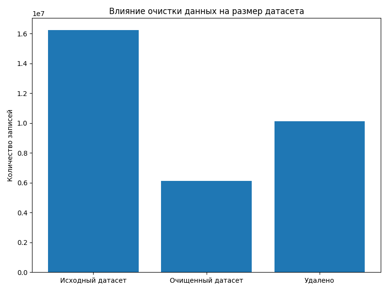
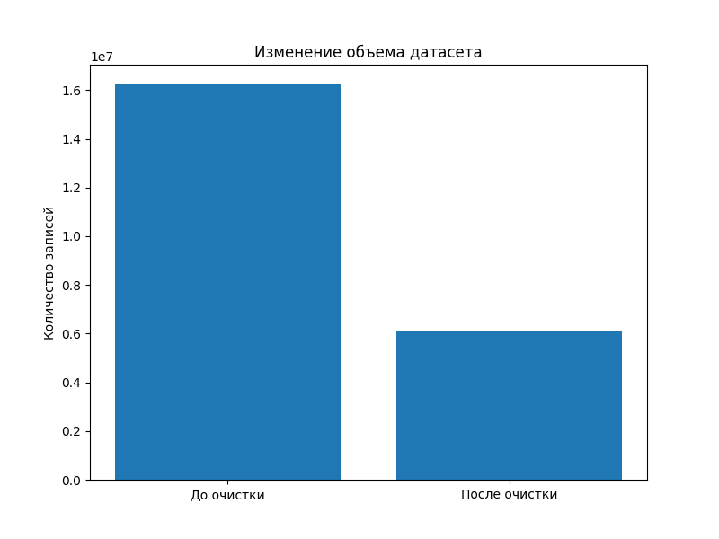
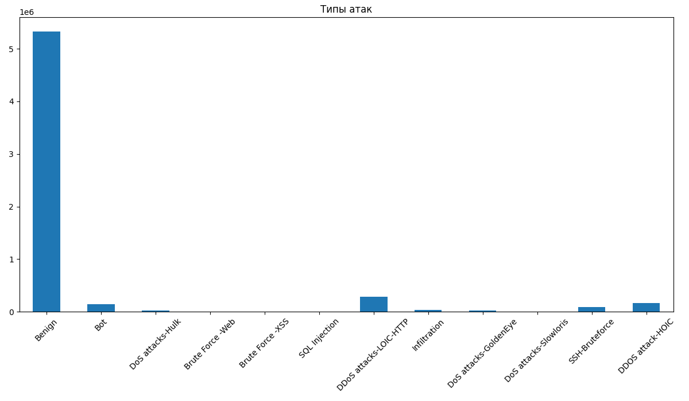
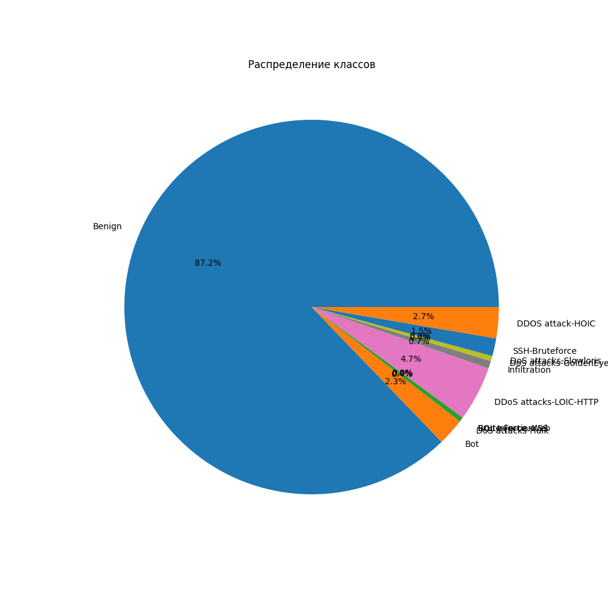
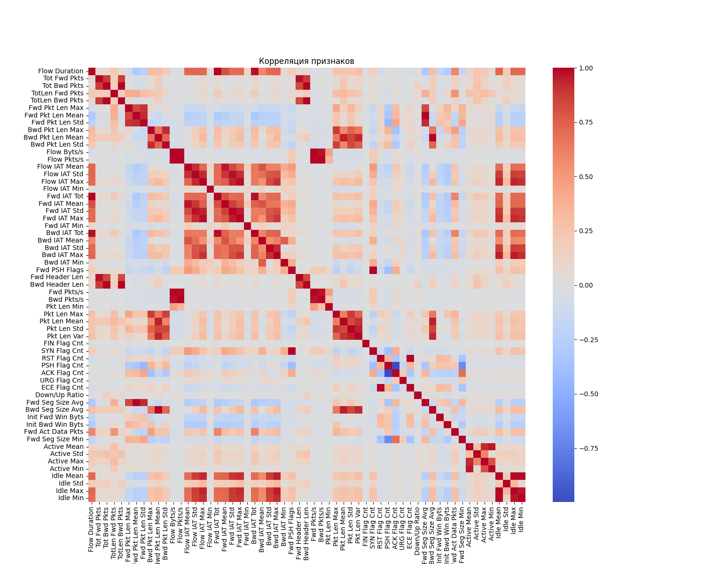

## Visualization of dataset analysis results

In the course of the work, graphs were constructed reflecting the data structure, the quality of the dataset, and the distribution of network traffic.

---

## 1. The impact of data cleanup on dataset size

This graph shows the change in the number of records after completing the preprocessing stage.

### Interpretation:

- the first column reflects the initial number of network flows;
- the second column shows the amount of data after deleting incorrect values;
- the third indicator shows the volume of deleted records.

Deletion is due to:
- missing values (NaN);
- infinite values (inf);
- incorrect or corrupted lines.

### Output:

Clearing the data reduces the volume of the dataset, but increases its quality and suitability for further analysis and model training.

---

## 2. Comparing the amount of data before and after the cleanup

The graph shows the total number of records in the original and processed datasets.

### Interpretation:

- the first column is the source dataset with the raw data;
- the second column is the dataset after preprocessing;
- the difference between the values reflects the number of deleted rows.

### Output:

The difference confirms the presence of noisy and incorrect data, which must be deleted before training machine learning models.

---

##3. Distribution of network attack types

The graph shows the distribution of network traffic classes, including normal connections and various types of attacks.

### Interpretation:

- normal traffic makes up the bulk of the data;
- attacking events are represented by a smaller proportion;
- Different types of attacks are unevenly distributed.

### Output:

There is a pronounced class imbalance, which is a critical factor in model training, as it can lead to a bias towards the dominant class.

---

##4. Class distribution (pie chart)

The pie chart shows the percentage of normal and malicious traffic.

### Interpretation:

- about 87% of the data is related to normal traffic;
- about 13% relate to attacks;
- the strong predominance of one class is confirmed.

### Output:

Class imbalance requires the use of data balancing methods (SMOTE, undersampling, class weights) or the use of metrics that are resistant to imbalance (F1-score, Recall).

---

##5. Correlation of features

The graph shows the degree of relationship between the numerical features of the dataset.

### Interpretation:

- light and dark areas show strong correlations between the signs;
- some of the signs have a high correlation, which indicates the redundancy of information;
- some signs are practically unrelated.

### Output:

The presence of a strong correlation between features can lead to multicollinearity, which negatively affects some machine learning models (for example, linear models).

---

## General visualization conclusion

The constructed graphs allow us to draw the following conclusions:

- the dataset contains a significant amount of noise data;
- cleaning significantly reduces the size of the data, but improves its quality;
- there is a pronounced class imbalance;
- there is a high correlation between some of the features.

Taken together, this confirms the need for careful data preprocessing before building machine learning models.
