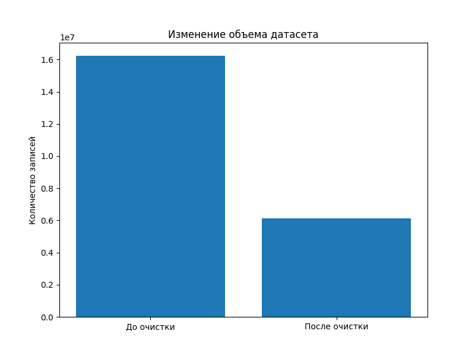
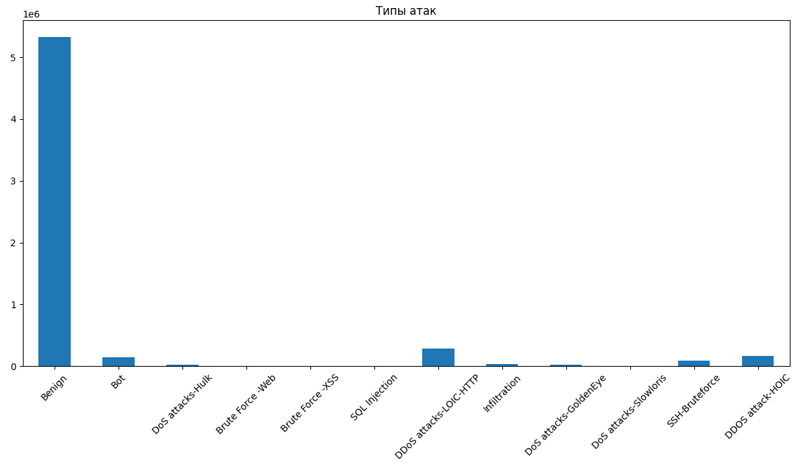
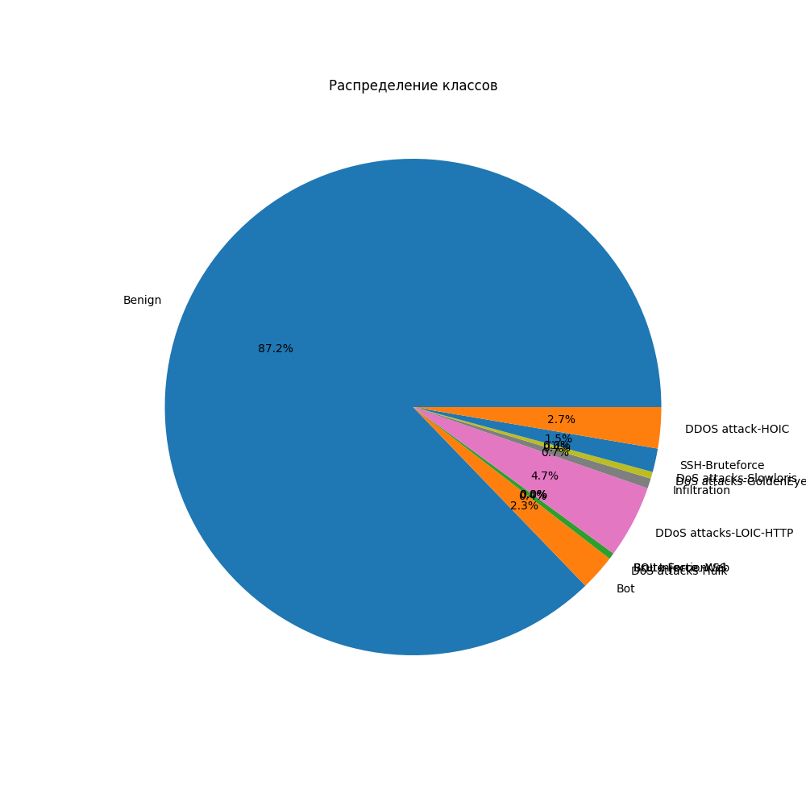
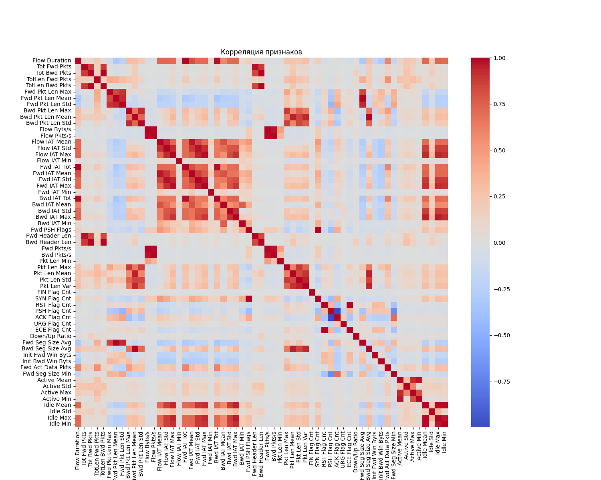

# 6. graphs.md

```markdown
# Визуализация результатов

## Пропущенные значения


---

## До и после очистки



---

## Типы атак



---

## Распределение классов



---

## Корреляция признаков

