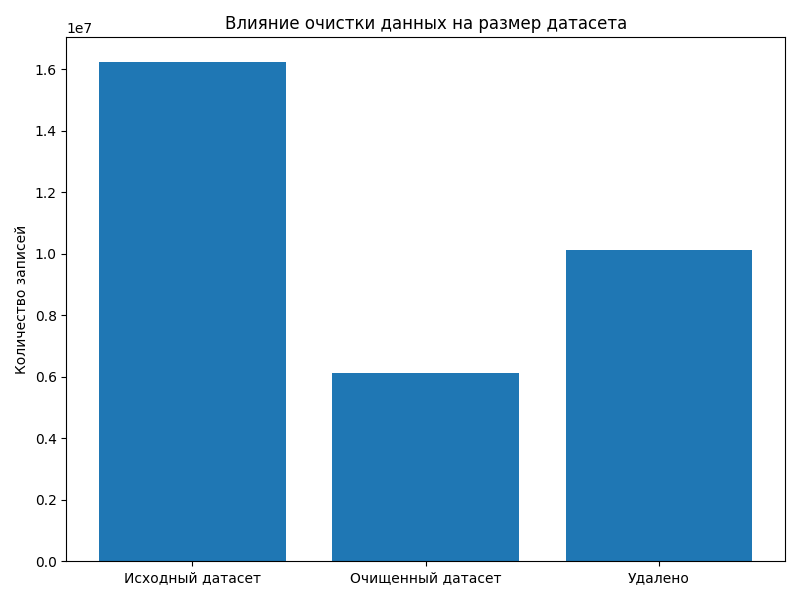

## Визуализация результатов анализа датасета

В ходе работы были построены графики, отражающие структуру данных, качество датасета и особенности распределения сетевого трафика.

---

## 1. Влияние очистки данных на размер датасета

Данный график показывает изменение количества записей после выполнения этапа предобработки.

### Интерпретация:

- первый столбец отражает исходное количество сетевых потоков;
- второй столбец показывает количество данных после удаления некорректных значений;
- третий показатель демонстрирует объём удалённых записей.

Удаление связано с:
- пропущенными значениями (NaN);
- бесконечными значениями (inf);
- некорректными или повреждёнными строками.

### Вывод:

Очистка данных приводит к уменьшению объёма датасета, однако повышает его качество и пригодность для дальнейшего анализа и обучения моделей.

---

## 2. Сравнение объема данных до и после очистки

График отображает общее количество записей в исходном и обработанном наборах данных.

### Интерпретация:

- первый столбец — исходный датасет с необработанными данными;
- второй столбец — датасет после предобработки;
- разница между значениями отражает количество удалённых строк.

### Вывод:

Разница подтверждает наличие шумовых и некорректных данных, которые необходимо удалять перед обучением моделей машинного обучения.

---

## 3. Распределение типов сетевых атак

График показывает распределение классов сетевого трафика, включая нормальные соединения и различные типы атак.

### Интерпретация:

- нормальный трафик составляет основную часть данных;
- атакующие события представлены меньшей долей;
- различные типы атак распределены неравномерно.

### Вывод:

Наблюдается выраженный дисбаланс классов, который является критическим фактором при обучении моделей, так как может приводить к смещению в сторону доминирующего класса.

---

## 4. Распределение классов (круговая диаграмма)

Круговая диаграмма отображает процентное соотношение нормального и вредоносного трафика.

### Интерпретация:

- около 87% данных относятся к нормальному трафику;
- около 13% относятся к атакам;
- подтверждается сильное преобладание одного класса.

### Вывод:

Дисбаланс классов требует применения методов балансировки данных (SMOTE, undersampling, class weights) или использования метрик, устойчивых к дисбалансу (F1-score, Recall).

---

## 5. Корреляция признаков

График отображает степень взаимосвязи между числовыми признаками датасета.

### Интерпретация:

- светлые и тёмные области показывают сильные зависимости между признаками;
- часть признаков имеет высокую корреляцию, что указывает на избыточность информации;
- некоторые признаки практически не связаны между собой.

### Вывод:

Наличие сильной корреляции между признаками может привести к мультиколлинеарности, что негативно влияет на некоторые модели машинного обучения (например, линейные модели).

---

## Общий вывод по визуализации

Построенные графики позволяют сделать следующие выводы:

- датасет содержит значительное количество шумовых данных;
- очистка существенно уменьшает размер данных, но повышает их качество;
- присутствует выраженный дисбаланс классов;
- наблюдается высокая корреляция между частью признаков.

В совокупности это подтверждает необходимость тщательной предобработки данных перед построением моделей машинного обучения.